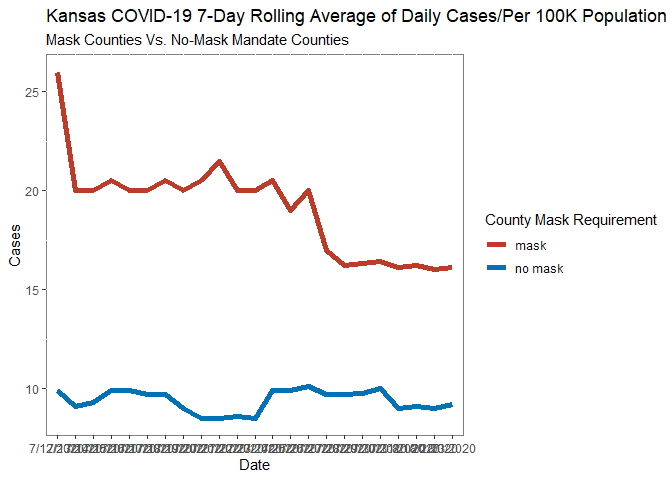

Lab 07 - Conveying the right message through visualisation
================
Colin Li
3/1/2023

### Load packages and data

``` r
library(tidyverse) 
library(haven)
library(ggplot2)
library(ggsci)
```

this graph is very strange, I don’t understand why there are two y axes
and why they correspond to different values. Shouldn’t the colors be
legends? The lines are also confusing: the background lines do not match
the dates. For example, for masked counties on 07/13/2020, I don’t know
whether the cases are 20 or 22. Essentially, I think the graph is trying
to say that mask mandate counties have lower cases overtime.

### Exercise 1

``` r
mask <- tribble(
  ~date, ~count,
  "07/12/2020", 26,
  "07/13/2020", 20,
  "07/14/2020", 20,
  "07/15/2020", 20.5,
  "07/16/2020", 20,
  "07/17/2020", 20,
  "07/18/2020", 20.5,
  "07/19/2020", 20,
  "07/20/2020", 20.5,
  "07/21/2020", 21.5,
  "07/22/2020", 20,
  "07/23/2020", 20, 
  "07/24/2020", 20.5,
  "07/25/2020", 19,
  "07/26/2020", 20,
  "07/27/2020", 17,
  "07/28/2020", 16.2,
  "07/29/2020", 16.3,
  "07/30/2020", 16.4,
  "07/31/2020", 16.1,
  "08/01/2020", 16.2,
  "08/02/2020", 16,
  "08/03/2020", 16.1,
)

nomask <- tribble(
  ~date, ~count,
  "07/12/2020", 9.9,
  "07/13/2020", 9.1,
  "07/14/2020", 9.3,
  "07/15/2020", 9.9,
  "07/16/2020", 9.9,
  "07/17/2020", 9.7,
  "07/18/2020", 9.7,
  "07/19/2020", 9,
  "07/20/2020", 8.5,
  "07/21/2020", 8.5,
  "07/22/2020", 8.6,
  "07/23/2020", 8.5, 
  "07/24/2020", 9.9,
  "07/25/2020", 9.9,
  "07/26/2020", 10.1,
  "07/27/2020", 9.7,
  "07/28/2020", 9.7,
  "07/29/2020", 9.75,
  "07/30/2020", 10,
  "07/31/2020", 9,
  "08/01/2020", 9.1,
  "08/02/2020", 9,
  "08/03/2020", 9.2,
)

merged_data <- merge(mask, nomask, by = "date")

merged_data$mask <- merged_data$count.x
merged_data$nomask <- merged_data$count.y


#I want to create a condition variable and combine cases into one column but forgot how to do that in R, so I did it in excel

maskd <- read_csv("C:/Users/Colin/Downloads/mask.csv")
```

    ## Rows: 46 Columns: 3
    ## ── Column specification ────────────────────────────────────────────────────────
    ## Delimiter: ","
    ## chr (2): date, condition
    ## dbl (1): cases
    ## 
    ## ℹ Use `spec()` to retrieve the full column specification for this data.
    ## ℹ Specify the column types or set `show_col_types = FALSE` to quiet this message.

``` r
maskd %>%
  ggplot(aes(x = date, y = cases, group = condition, color = condition)) + geom_line(linewidth = 2) + scale_color_jama() + theme(panel.background = element_rect(fill = "white", colour = "grey50"), legend.key = element_rect(fill = "white", color = NA)) + ggtitle("Kansas COVID-19 7-Day Rolling Average of Daily Cases/Per 100K Population") + theme(strip.background = element_rect(fill="white"), strip.text = element_text(size = 10, face = "bold")) + labs(subtitle = "Mask Counties Vs. No-Mask Mandate Counties", x = "Date", y = "Cases", color = "County Mask Requirement")
```

<!-- -->

### Exercise 2

…

Add exercise headings as needed.
